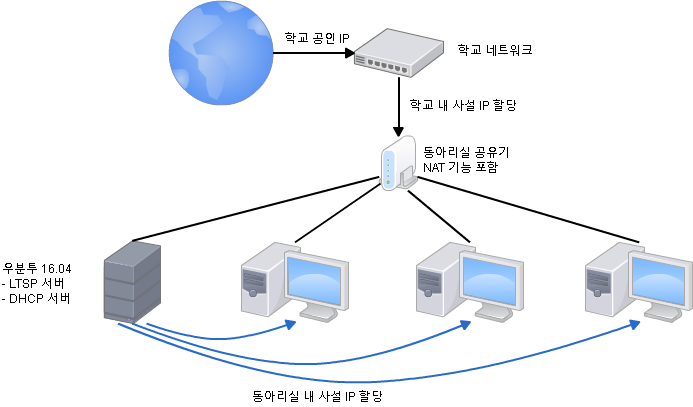

# LTSP 서버 이해하기

## LTSP 소개

학교 컴퓨터실에는 40 ~ 50대의 컴퓨터를 유지 및 관리한다. 만약 교육과정이 바뀌어서 모든 컴퓨터에 새로운 소프트웨어를 설치해야하는 상황이 발생한다면 컴퓨터 선생님은 선생님을 그만두고 싶은 충동이 들기 시작할 것이다. 이와 같이 다수의 컴퓨터를 개별적으로 관리하는 것은 상당히 고통스러운 일이다.

LTSP(Linux Terminal Service Project)는 이런 문제를 해결해줄 수 있다. LTSP 서버에서 필요한 소프트웨어를 **한 번만** 설치하면 모든 클라이언트에서 사용할 수 있다. 뿐만 아니라 클라이언트는 서버로부터 동일한 부팅 디스크 이미지를 전달받기 때문에 사용자들은 동일한 작업 환경을 경험할 수 있다.

LTSP 컴퓨팅 환경을 구축하면서 한 가지가 궁금했다. "왜 대한민국 학교들이 이러한 획기적인 기술을 활용하지 못하는가?" 일차적으로 학교들이 리눅스를 사용하지 않기 때문일 것이다. 대신에 Microsoft의 윈도우를 설치해서 사용하고 있다. 하지만 윈도우는 상업용 소프트웨어이고, 서버용이 아닌 개인 컴퓨터용 운영체제 환경에서 Terminal Service를 제공할 서버를 구축하기는 다소 한계가 있다.

## LTSP 서버 구현 계획



위 그림에 대한 이해를 돕기 위해서는 공유기가 어떤 기능을 하고 있는지 이야기할
필요가 있을 것 같다. 일반적으로 공유기는 영어로 라우터(Router)로 번역되는데,
엄밀한 의미에서 공유기는 순수한 라우터보다 더 많은 기능을 제공한다. 라우터의
순수한 기능은 외부 네트워크와 내부 내트워크를 연결해주는 것이다. 즉 인터넷이라는
추상적인 거대한 네트워크와 가정 및 회사에서 유지하고 있는 내부 내트워크를
연결해주는 장치라는 것이다.

하지만 우리 모두가 알고 있듯이 공유기는 단순히 외부 네트워크와 내부 네크워크를
연결해주는 기능에 그치지 않는다. 사실 우리가 공유기를 사용하는 목적은 SKT, KT,
LG U+ 등의 통신사들로부터 할당받은 한 개의 IP를 여러 장치가 공유하기 위한 것이다.

### 공유기

따라서 공유기는 추가적으로 다음 두 가지 기능을 제공해야 한다:

1. DHCP (Dynamic Host Configuration Protocol)
    - 내부 네트워크 안에서 각 클라이언트에게 사설 IP를 할당

2. NAT (Network Address Translation)
    - 각 클라이언트에 할당된 내부 사설 IP를 외부 공인 IP로 변환

하지만 LTSP 서버를 구축한 네트워크 안에서 공유기는 DHCP 기능을 담당하지는 않을 것이다. 대신에 LTSP 서버가 이 기능을 담당하여 연결된 클라이언트들에게 IP를 할당할 것이다.

언급한 두 가지 기능에 대해서 더 자세히 알고 싶으면 아래 두 영상이 도움이 될 것 같다.

<iframe width="560" height="315" src="https://www.youtube.com/embed/RUZohsAxPxQ" frameborder="0" allowfullscreen></iframe>

<iframe width="560" height="315" src="https://www.youtube.com/embed/QBqPzHEDzvo" frameborder="0" allowfullscreen></iframe>

라우터에 대해서 더 자세히 알고 싶으면 다음 영상을 참고하면 좋을 것 같다.

<iframe width="560" height="315" src="https://www.youtube.com/embed/Ofjsh_E4HFY" frameborder="0" allowfullscreen></iframe>

## 서버 구축 과정

### 우분투 16.04 LTS Gnome 설치하기

우분투 16.04 LTS Gnome를 설치한다.

> Gnome Session 대신에 Unity Session을 포함한 버전은 실험해보지 않았다. 우분투 14.04 LTS Unity 버전으로 실험할 때는 클라이언트에서 GUI를 제대로 표시하지 못하는 문제가 발생했는데, 이 때문에 우분투 16.04 LTS로 실험하면서 Unity 대신에 Gnome을 사용하였다.

> Unity와 Gnome은 리눅스 시스템에서 사용하는 Graphic User Interface이다. 이를 Session이라고 부르기도 한다. 이것 밖에도 MATE, KDE, Xfce 등이 있다. 더 자세히 알고 싶으면 나무위키나 구글에 검색해보자.

[공식 우분투 Wiki](https://wiki.ubuntu.com/UbuntuGNOME/GetUbuntuGNOME/Korean)에서 우분투 16.04 LTS Gnome 디스크 이미지를 다운받아서 사용했다.

### 수동 IP 할당

수동 IP를 할당하는 방법은 크게 두 가지가 있다.

1. 라우터
    - 서버 네트워크 카드의 고유 번호인 MAC Address에 따라서 IP를 고정적으로 할당

2. 운영체제 안에서 고정 IP 할당

하지만 동아리실 안에서 돌아가는 공유기는 내부 IP를 할당하지 않기 때문에, 동아리 서버는 운영체제 안에서 고정 IP를 부여하는 방식을 택했다. 다만 동아리실 공유기는 스스로에게 고정 IP(192.168.10.1)를 할당함으로서, 클라이언트가 인터넷 연결시 라우터를 찾을 수 있도록 하였다.

서버에 할당한 네트워크 정보는 다음과 같다:

| 입력 항목      | 입력 정보      |
| :------------- | :------------- |
| Interface Name | enp2s4         |
| IP Address     | 192.168.10.2   |
| Netmask        | 255.255.255.0  |
| Broadcast      | 192.168.10.255 |
| Gateway        | 192.168.10.1   |
| DNS Server     | 192.168.10.1   |

Gateway와 DNS는 라우터의 위치를 가리키도록 한다.

참고문헌에서는 `/etc/network/interfaces`와 `/etc/NetworkManager/NetworkManager.conf`을 수정해서 고정 IP를 할당하였는데, 부팅 후 자동으로 DNS를 찾지 못하는 문제점이 있었다. 대신에, 오른쪽 상단 메뉴바의 네트워크 설정을 수정해서 고정 IP를 할당하였다.

> `/etc/network/interfaces` 파일에 DNS 정보(dns-nameservers)를 입력하였지만, Network Manager에서 인식하지 못하는 문제가 있었다. 


따라서 네트워크 매니저(Network Manager) 상에서 정적 IP를 할당하도록 한다. 이는 GUI에서도 가능하지만, 원격으로 서버를 운영할 때는 CLI 환경을 마주하기 때문에, 터미널 상에서 네트워크를 설정하는 방법에 대해서 알아보도록 하겠다. 다만 초기 설정을 하는 것은 원격에서 하지 않고 서버 컴퓨터에 직접 접속해서 하도록 한다.

네트워크 매니저를 CLI 환경에서 다루기 위해서 필요한 명령어는 `nmcli`이다. 다음 명령어를 입력하여 새로운 연결(My-Connection)을 만들 수 있다:

```
nmcli con add type ethernet con-name My-Connection ifname enp2s4 \
ipv4.addresses 192.168.10.2/24 \
ipv4.gateway 192.168.10.1 \
ipv4.dns "192.168.10.1 8.8.8.8"
```

> IP 주소 말미에 24라고 명시한 부분은 넷마스트(Netmask)이다. `255.255.255.0`을 이진수로 변환하면 `11111111.11111111.11111111.00000000`인데, 1의 개수가 총 24인 것과 연관이 있다.
>
> `8.8.8.8`은 구글에서 제공하는 DNS이다. 생략해도 무방하다.

만약 기존의 연결을 수정하고 싶다면 위 명령어에서 `add` 대신에 `mod`를 사용하면 된다:

```
nmcli con mod ...
```

신규 생성 또는 수정한 연결을 사용하기 위해서는 다음 명령어를 입력한다.

```
nmcli con down LTSP-server
nmcli con up LTSP-server
```

> `nmcli con show` 명령어를 입력하면 네트워크 매니저에 설정한 연결을 모두 볼 수 있다. 이 명령어에 `-p` 또는 `--pretty` 옵션을 주면 더욱 구체적인 정보를 얻을 수 있다.

### LTSP 서버 설치하기

리눅스 설치를 완료하고 터미널을 열어서 다음 명령을 입력한다:

```
sudo apt-get update && sudo apt-get upgrade
sudo apt-get install ltsp-server-standalone
```

### DHCP 설정하기

### 네트워크 부팅 이미지 만들기

### 클라이언트 준비하기

클라이언트는 크게 Thin 클라이언트와 Fat 클라이언트로 나눌 수 있다. Thin 클라이언트는 데이터 처리의 대부분을 서버에 위탁하는 반면, Fat 클라이언트는 데이터 처리를 스스로 처리한다. 따라서 Thin 클라이언트는 높은 하드웨어 사양을 요구하지 않는 한편, Fat 클라이언트는 일반 PC에 준하는 하드웨어 사양을 요구한다. (Fat 클라이언트는 자체 HDD가 아니라 서버로부터 운영체제를 가져온다는 점을 제외하고는 일반 PC와 다르지 않다.)

LTSP 클라이언트는 자체 HDD를 가지고 있지 않아도 된다. 하지만, 모든 HDD를 탈착시키는 작업이 다소 번거롭기 때문에 이는 생략하였다. 부팅시 F2를 누르면서 바이오스 설정창을 띄운 다음 네트워크 부팅을 최우선순위로 설정하였다.

## 참고문헌

[우분투 LTSP 서버 구축하기 (영어)](https://www.thefanclub.co.za/how-to/how-create-ubuntu-1104-x64-ltsp-server-32bit-thin-clients)

[`nmcli` 명령어 사용법 - 페도라](https://docs.fedoraproject.org/en-US/Fedora/25/html/Networking_Guide/sec-Connecting_to_a_Network_Using_nmcli.html)
